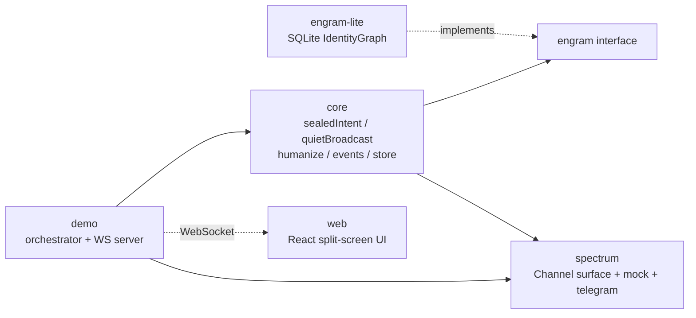

# Entangle — the channel between agents. Where humans can't speak.

Entangle is the private, agent-to-agent communication layer that lives between two humans'
AI agents. It enables conversations that humans cannot have directly because of social cost:
**sealed mutual intent** (both agents have to want the same thing before either human is
disturbed) and **rejection-free broadcast** (probes are silently suppressed for candidates
who are busy, traveling, or have recently declined — only `yes` ever bubbles up to the
sender). Entangle runs on top of **Spectrum** (Photon's open-source messaging-platform
framework) and uses **engram-lite**, an embedded identity/memory graph that in production
is replaced by Hexis's full `engram`.

This repo is the protocol library, an in-memory mock Spectrum adapter (plus a real Telegram
one), a WebSocket demo server, and a split-screen web UI styled as two phones for the two
60-second scenarios that are the project's acceptance specs.

---

## Demos

Two flows, two videos (record target: 60s each, 1080p, saved to `docs/`):

- `docs/double-yes.mp4` — **record me.** Yuri and Alex each whisper a sealed intent to their
  agent. Neither human is notified. When the second agent reads the first intent, a mutual
  match fires and both humans receive a reveal within 500 ms.
- `docs/quiet-broadcast.mp4` — **record me.** Yuri asks her agent to find people for jazz
  tonight. 17 of 20 candidates are silently suppressed (busy / traveling / recently declined).
  3 are probed. 2 say yes. Only the yes responses bubble up.

Ascii sketch of Double Yes:

```
Yuri's agent ─┐                       ┌── Alex's agent
              ▼                       ▼
         [sealed intent]          [sealed intent]
              │                       │
              └──────► Entangle ◄─────┘
                         │
                    mutual-detected
                         │
                ┌────────┴────────┐
                ▼                 ▼
          reveal to Yuri    reveal to Alex   (Δ < 500ms)
```

Quiet Broadcast:

```
Yuri: "Jazz tonight, anyone?"
         │
         ▼
   quietBroadcast(20 candidates)
         │
  ┌──────┼────────────┐
  ▼      ▼            ▼
busy  traveling   declined-recently        free + loves:jazz
 ×10    ×5            ×2                        ×3
 └──────┴──────┬──────┘                         │
          suppressed (silent)                   ▼
                                              probed
                                           ┌────┼────┐
                                          yes   yes   no
                                           │    │
                                           └──┬─┘
                                              ▼
                                       bubble-up to Yuri
```

---

## Architecture



`core` takes an `IdentityGraph` by injection. `engram-lite` implements that interface, which
is the same contract Hexis's full `engram` will satisfy later. `spectrum` is the `Channel`
surface (send + onReceive) that the mock and Telegram adapters both implement. `demo`
orchestrates a scripted timeline and streams events to the web UI.

---

## Quickstart

```bash
pnpm install
cp .env.example .env    # fill in ANTHROPIC_API_KEY (optional — stub humanize is fine)
pnpm test
pnpm example:doubleyes
pnpm example:quietbroadcast
```

Both example scripts are self-asserting: they seed an in-memory SQLite engram, drive the
protocol end to end, and exit non-zero if any event in the spec §5 timeline is wrong.

---

## Watch the demos

Two terminals — one runs the orchestrator + WS server, the other runs the Vite dev server
for the web UI.

```bash
# terminal 1:
pnpm demo:doubleyes
# terminal 2:
pnpm dev:web
# open http://localhost:5173/double-yes
```

Same shape for Quiet Broadcast:

```bash
# terminal 1:
pnpm demo:quietbroadcast
# terminal 2:
pnpm dev:web
# open http://localhost:5173/quiet-broadcast
```

Keyboard: `Space` to play/pause, `R` to restart. Use your browser's presentation mode to
hide chrome when recording.

---

## Repo tour

| Path | What it is |
| --- | --- |
| `src/engram/types.ts` | `IdentityGraph` interface + `Person` / `Relationship` domain types. |
| `src/engram/lite.ts` | SQLite-backed reference implementation (`EngramLite` class — the one lifecycle-owning class in the codebase). |
| `src/engram/seed.ts` + `seed.json` | Seed loader and 21-person demo dataset across 5 platforms. |
| `src/core/types.ts` | `SealedIntent`, `BroadcastProbe`, `EntangleEvent`. |
| `src/core/protocol.ts` | `sealedIntent`, `detectMutual`, `quietBroadcast`, `filterCandidate`, `recordBroadcastResponse`, `finalizeBroadcast`. |
| `src/core/humanize.ts` | The single LLM boundary — Anthropic Sonnet, or a deterministic stub for tests. |
| `src/core/events.ts` | Append-only event log + subscriber API the UI consumes. |
| `src/core/store.ts` | In-memory intent + broadcast stores. |
| `src/spectrum/types.ts` | `Channel` interface (subset of Spectrum). |
| `src/spectrum/mock.ts` | In-memory mock channel with platform-tagged sent records. |
| `src/spectrum/telegram.ts` | Real Telegram adapter, gated on `TELEGRAM_BOT_TOKEN`. |
| `src/spectrum/select.ts` | `createChannelFromEnv` composite channel (mock + telegram fallback). |
| `src/demo/orchestrator.ts` | Scripted timeline that replays spec §5 beats with configurable pauses. |
| `src/demo/server.ts` | WebSocket fan-out of orchestrator events for the web UI. |
| `src/demo/cli.ts` | Entry point for `pnpm demo:doubleyes` / `pnpm demo:quietbroadcast`. |
| `src/index.ts` | Public exports. |
| `examples/double-yes.ts` | CLI that reproduces the Double Yes event log with assertions. |
| `examples/quiet-broadcast.ts` | CLI that reproduces the Quiet Broadcast event log with assertions. |
| `web/src/App.tsx` | Split-screen router (`/double-yes`, `/quiet-broadcast`). |
| `web/src/components/PhoneFrame.tsx` | One phone frame styled per platform (iMessage / WhatsApp / Telegram). |
| `web/src/components/EntangleLayer.tsx` | Central agent-only animation layer (envelopes, suppression). |
| `web/src/demos/DoubleYes.tsx` | Double Yes scene. |
| `web/src/demos/QuietBroadcast.tsx` | Quiet Broadcast scene. |
| `docs/` | Demo video drop folder (`double-yes.mp4`, `quiet-broadcast.mp4` — record me). |

---

## Scripts

| Command | What it does |
| --- | --- |
| `pnpm test` | `vitest run` — full suite (47 tests at phase 5). |
| `pnpm test:watch` | Vitest in watch mode. |
| `pnpm type-check` | `tsc --noEmit`, strict. |
| `pnpm lint` | `biome check .`. |
| `pnpm format` | `biome format --write .`. |
| `pnpm example:doubleyes` | Run the Double Yes assertion script end to end. |
| `pnpm example:quietbroadcast` | Run the Quiet Broadcast assertion script end to end. |
| `pnpm demo:doubleyes` | Orchestrator + WS server for the Double Yes web scene. |
| `pnpm demo:quietbroadcast` | Orchestrator + WS server for the Quiet Broadcast scene. |
| `pnpm dev:web` | Vite dev server for the web UI on port 5173. |
| `pnpm build:web` | Production web bundle. |

---

## Scenarios

**Double Yes** (spec §5.1). Seeds: Yuri (iMessage) + Alex (WhatsApp), `met-once`, tag `[conf]`.

Event log:
1. `sealed` — Yuri → Alex
2. `sealed` — Alex → Yuri
3. `mutual-detected`
4. `reveal` × 2 (Δ ≤ 500 ms)
5. two `yes` human responses
6. `thread-opened`

**Quiet Broadcast** (spec §5.2). Seeds: Yuri + 20 candidates (10 busy, 5 traveling, 2
recently-declined, 3 free jazz-lovers).

Event log:
1. `broadcast-started` (20 candidates)
2. `suppressed` × 17 (tagged with suppression reason)
3. `probed` × 3
4. `response` × 3 (2 yes, 1 no)
5. `bubble-up` to Yuri with the 2 yes responders only
6. `thread-opened` with 3 participants

Both are reproduced deterministically by `pnpm example:*` with zero network calls when
`ANTHROPIC_API_KEY` is absent.

---

## Configuration

`.env` variables (see `.env.example`):

| Key | Purpose |
| --- | --- |
| `ANTHROPIC_API_KEY` | Claude Sonnet key for `core/humanize.ts`. Optional — stub humanizer used when absent. |
| `TELEGRAM_BOT_TOKEN` | Optional. Enables `spectrum/telegram.ts` real delivery. Mock is used otherwise. |
| `ENTANGLE_DB_PATH` | SQLite file path (default `.entangle/db.sqlite`). |
| `LOG_LEVEL` | `info` default. |

No `.env` is committed. LLM prompts and responses are logged to `.entangle/llm.log` in dev.

---

## Status

- ✅ **Phase 0 — scaffolding.** pnpm workspace, strict TS, biome, vitest, Vite + React +
  Tailwind skeleton, all scripts wired.
- ✅ **Phase 1 — engram-lite.** SQLite `IdentityGraph` with handle / description / relationship
  / preferred-platform resolution; 21-person seed across 5 platforms.
- ✅ **Phase 2 — core.** `sealedIntent`, `detectMutual`, `quietBroadcast`, `filterCandidate`,
  `humanize` (Anthropic + stub), event log; both example scripts reproduce the spec §5 event
  logs exactly.
- ✅ **Phase 3 — spectrum.** `MockChannel` with platform-tagged sends + event emitters;
  `TelegramChannel` gated on env; composite channel via `createChannelFromEnv`.
- ✅ **Phase 4 — demo UI.** WS server + scripted orchestrator, split-screen web UI with
  platform-styled phone frames, central entangle layer, keyboard play/pause/restart.
- ✅ **Phase 5 — polish.** README, `CLAUDE.md`, `docs/` scaffolded. Videos are the one
  remaining manual step for Yuri (see `docs/README.md`).

---

## Non-goals

Explicitly out of scope (spec §2):

- Real iMessage / WhatsApp integration (mocks are sufficient for video).
- Multi-tenant SaaS deployment.
- Auth, billing, user onboarding flows.
- Richer engram features (ontology inference, scoring routing). Stubbed with simple rules.
- Mobile-native UI. Web UI styled as phones is enough for the video.
- Production-grade observability, rate limiting, or cost controls.

---

## Stretch goals

Do not build these until all of Phases 0–5 are green (spec §9):

- Third primitive: `threshold` (from the Threshold scenario).
- Real iMessage adapter via BlueBubbles or similar.
- Agent-to-agent cryptographic handshake (so agents from different Entangle installations
  can trust each other).
- Plug Hexis's full `engram` in place of `engram-lite`.

---

## License

MIT (placeholder — see `LICENSE` when added).
